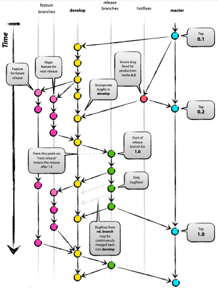

# Git Flow <!-- omit in toc -->

## Table of Contents <!-- omit in toc -->

- [1. Overview](#1-overview)
- [2. Branches](#2-branches)
- [3. Flow](#3-flow)
  - [3.1 Initialize a new project](#31-initialize-a-new-project)
  - [3.2 Developer role](#32-developer-role)
  - [3.3 Release manager role](#33-release-manager-role)
  - [3.4 Good practices](#34-good-practices)
- [4. Pros](#4-pros)
- [5. Cons](#5-cons)
- [6. References](#6-references)

## 1. Overview

## 2. Branches

- **main**
  - developer MUST NOT use force push on this branch
  - developer MUST open a pull request to add changes to this branch
  - infinite lifetime
- **develop**
  - developer MUST NOT use force push on this branch
  - developer MUST open a pull request to add changes to this branch
  - infinite lifetime
  - branches off the **main** branch
- **feature**
  - short-lived
  - branches off the **develop** branch
  - develop new features
- **release**
  - short-lived
  - branches off the **develop** branch
  - must be merged back to both **develop** and **main**
  - helps prepare a new production release
- **hotfix**
  - short-lived
  - arise from a bug that has been discovered and must be resolved
  - helps prepare for a release

## 3. Flow

### 3.1 Initialize a new project

1. Create a new repository with the **main** branch as default.
2. Immediately create and checkout a new branch named **develop**.

### 3.2 Developer role

**Feature and bugfix**:
1. Create a new **feature** or **bugfix** branch from **develop** following naming conventions available [here](../naming.md).
2. Start working on the feature or bugfix.
3. Rebase the branch onto **develop** before creating a pull request to merge it into **develop**.
4. Merge the branch into **develop** when ready and after review.
5. Delete the **feature** or **bugfix** branch.

**Hotfix**:
1. Create a new hotfix branch from **main** following naming conventions available [here](../naming.md).
2. Start working on the hotfix.
3. Update PATCH version number in concerned files.
4. Merge to **main** using a pull request when ready and after peer review.
5. Merge to **develop** using a pull request when ready and after peer review.
6. Delete the **hotfix** branch.

### 3.3 Release manager role

**Release candidate**:
1. Create a new **release** branch from **develop** following naming conventions available [here](../naming.md).
2. Fix bugs directly on this branch if any.
3. Bump version and update release notes when ready.
4. Merge this branch into **develop** and **main** after peer review.
5. Add a release tag.

### 3.4 Good practices

- **Delete the feature / bugfix / hotfix branch once done**: this indicates that the work on the branch is complete and prevents you or others from accidentally using old branches.

## 4. Pros

- allows for parallel development to protect the production code
- main branch remains stable for release while developers work on separate branches
- easier for developers to organize their work with various types of branches
- ideal when handling multiple versions of the production code
- allows for efficient testing with the systematic development process

## 5. Cons

- becomes difficult to manage as more branches are added
- could slow down the development process and release cycle
- not an efficient approach for teams wanting to implement CI/CD

## 6. References

General:
- https://www.flagship.io/git-branching-strategies/
- https://www.gitkraken.com/learn/git/best-practices/git-branch-strategy
- https://www.atlassian.com/git/tutorials/comparing-workflows/gitflow-workflow
- https://blog.mergify.com/the-best-git-branching-strategies/
- https://launchdarkly.com/blog/git-branching-strategies-vs-trunk-based-development/
- https://www.bmc.com/blogs/devops-branching-strategies/

Git extensions to provide high-level repository operations:
- https://github.com/petervanderdoes/gitflow-avh
- https://danielkummer.github.io/git-flow-cheatsheet/
- https://nvie.com/posts/a-successful-git-branching-model/

GitHub default branch master to main:
- https://github.com/github/renaming
