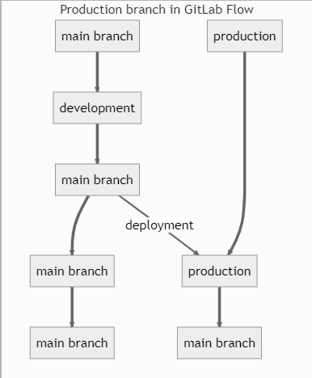
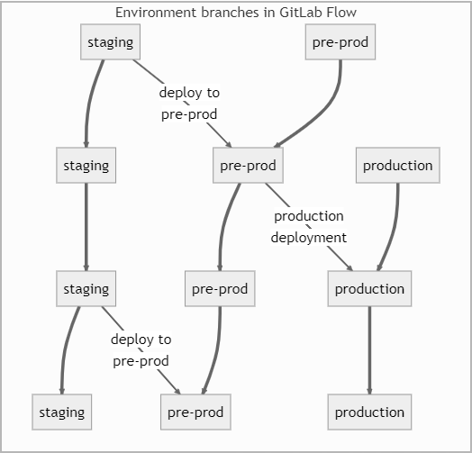
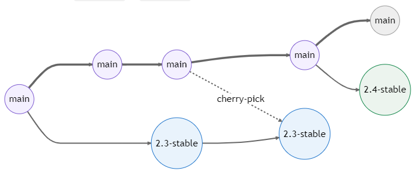

# GitLab Flow <!-- omit in toc -->

## Table of Contents <!-- omit in toc -->

- [1. Branches](#1-branches)
- [2. Flow](#2-flow)
  - [2.1 Production branch](#21-production-branch)
  - [2.2 Environment branches](#22-environment-branches)
  - [2.3 Release branches](#23-release-branches)
  - [2.4 Good practices](#24-good-practices)
- [4. Pros](#4-pros)
- [5. Cons](#5-cons)
- [6. References](#6-references)

## 1. Branches

- **feature**
  - short-lived
  - branches off the **main** branch
  - one developer at a time on a branch
  - develop new features
- **main or staging**
  - long-lived
- **pre-prod**
  - long-lived
  - developer MUST open a pull request to add changes to this branch
  - developer SHOULD NOT merge **feature** and **bugfix** branches directly into this branch
- **production**
  - long-lived
  - developer MUST NOT use force push on this branch
  - developer MUST open a pull request to add changes to this branch
  - developer MUST merge only stable features to this branch

Optional:
- **release**

## 2. Flow

### 2.1 Production branch

**Initialize a new project**

1. Create a new repository with the **main or staging** branch as default.
2. Create a **production** branch that reflects the deployed code.

**Developer role**

The work on the **main** branch works just like in [GitHub flow](github-flow.md).

1. Create a new **feature** or **bugfix** branch from **main** following naming conventions available [here](../naming.md).
2. Start working on the feature or bugfix.
3. Rebase the branch onto **main** before creating a pull request to merge it into **main** (avoid unnecessary merge commits).
4. Merge this branch into **main** after peer review.
5. Delete the **feature** or **bugfix** branch.

**Production manager role**

2. Bump version and update release notes when ready (if applicable).
1. Create a pull request to merge **main** into **production**.
2. Merge these branches after peer review.
3. Add a release tag.

### 2.2 Environment branches

**Initialize a new project**

1. Create a new repository with the **main or staging** branch as default.
2. Create a **pre-production** branch that reflects the intermediate environment and code (or multiple of those, named after the environments they are related to).
3. Create a **production** branch that reflects the deployed code.

**Developer role**

1. Create a new **feature** or **bugfix** branch from **main** following naming conventions available [here](../naming.md).
2. Start working on the feature or bugfix.
3. Rebase the branch onto **main** before creating a pull request to merge it into **main** (avoid unnecessary merge commits).
4. Merge this branch into **main** after peer review.
5. Delete the **feature** or **bugfix** branch.

**Pre-production manager role**

1. Create a pull request to merge **main** into **pre-production**.
2. Merge these branches after peer review.
3. Run tests, and if any bugs is found, ask a developer to create a **bugfix** branch from **main**, which will then be merged again in **main** first.

**Production manager role**

1. Bump version and update release notes when ready (if applicable).
2. Create a pull request to merge **pre-production** into **production**.
3. Merge these branches after peer review.
4. Add a release tag.

### 2.3 Release branches

Work with release branches only if you need to release software to the outside world. Each release branch contains a minor version.

**Developer role**

1. Create a new **feature** or **bugfix** branch from **main** following naming conventions available [here](../naming.md).
2. Start working on the feature or bugfix.
3. Rebase the branch onto **main** before creating a pull request to merge it into **main** (avoid unnecessary merge commits).
4. Merge this branch into **main** after peer review.
5. Delete the **feature** or **bugfix** branch.

**Release manager role**

1. Bump version and update release notes when ready.
2. Create a new **release** branch from **main** following naming conventions available [here](../naming.md).
3. Only add serious bug fixes to the branch (if applicable).
4. If possible, first merge these bug fixes into main, and then cherry-pick them into the release branch.

### 2.4 Good practices

- Commit often and push frequently.
- Protect the long-lived branches.
- **Delete the feature / bugfix branch once done**: this indicates that the work on the branch is complete and prevents you or others from accidentally using old branches.
- Whenever possible assign the merge request to the person who knows most about the codebase you are changing.
- Reopening an issue means creating a new feature branch with the same name and a new merge request.
- **Squash and merge**:
  - Small commits are joined together, making it simpler to revert all parts of a change.
  - Base branch remains clean, and contains meaningful commit messages.

## 4. Pros

- CI/CD friendly
- simpler alternative to GitFlow
- works with the main branch right away
- great for maintaining multiple environments, with staging separated from production
- offers propers isolation between environments allowing to maintain several versions of software
- ensures that everything has been tested on all environments before going live
- suited for situations where the timing of the release is uncertain
- suited for web development and continuous deployment

## 5. Cons

- more complex than GitHub Flow

## 6. References

General:
- https://www.flagship.io/git-branching-strategies/
- https://docs.gitlab.com/ee/topics/gitlab_flow.html
- https://docs.gitlab.com/ee/user/project/merge_requests/squash_and_merge.html

Gitlab default branch from master to main:
- https://about.gitlab.com/blog/2021/03/10/new-git-default-branch-name/
