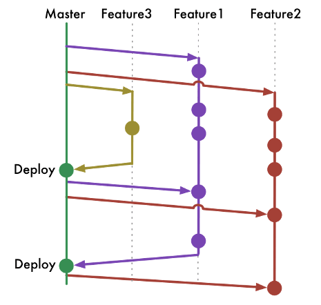

# Trunk-based Development <!-- omit in toc -->

## Table of Contents <!-- omit in toc -->

- [1. Overview](#1-overview)
- [2. Branches](#2-branches)
- [3. Flow](#3-flow)
  - [3.1 Initialize a new project](#31-initialize-a-new-project)
  - [3.2 Developer role](#32-developer-role)
  - [3.3 Feature flags or toggles](#33-feature-flags-or-toggles)
  - [3.4 Branch by abstraction](#34-branch-by-abstraction)
  - [3.5 Good practices](#35-good-practices)
- [4. Pros](#4-pros)
- [5. Cons](#5-cons)
- [6. References](#6-references)

## 1. Overview

## 2. Branches

- **trunk or main**
  - long-lived
  - developer MUST NOT use force push on this branch
  - developer SHOULD integrate changes into the shared trunk at least once a day
- **feature**
  - short-lived (couple of days max)
  - developer MUST open a pull request to add changes to the **trunk** branch
  - developer SHOULD NOT merge changes until he has verified that he can build successfully
  - branches off the **trunk** branch
  - one developer at a time on a branch
  - scaled trunk-based development

## 3. Flow

### 3.1 Initialize a new project

1. Create a new repository with the **trunk** branch as default.

### 3.2 Developer role

Scenario without short-lived feature branches
1. Start working on the feature.
2. Once done, check that the build is successful.
3. Commit changes to the **trunk** branch.

Scenario with short-lived feature branches
1. Create a new **feature** branch from **trunk** following naming conventions available [here](../naming.md).
2. Start working on the feature.
3. Create a pull request to merge it into **trunk**.
4. Merge this branch into **trunk** after peer review.
5. Delete the **feature** branch.

### 3.3 Feature flags or toggles

- Wrap new changes in an inactive code path and activate it at a later time
- Help decouple deployment from release

See [references](#6-references).

### 3.4 Branch by abstraction

- Make a large-scale change to a software system in a gradual way

See [references](#6-references).

### 3.5 Good practices

- Develop in small batches.
- Commit often and push frequently.
- Reduce the number of code freezes and integration phases
- **Delete the feature branch once done**: this indicates that the work on the branch is complete and prevents you or others from accidentally using old branches.
- Whenever possible assign the merge request to the person who knows most about the codebase you are changing.

## 4. Pros

- CI/CD friendly
- increases software delivery and organizational performance
- suited for developers to make small and frequent changes
- enhances collaboration as developers have better visibility over what changes other developers are making
- eliminates the stress of long-lived branches and merge conflicts as all developers work on the same branch
- allows for quicker releases as the shared trunk is kept in a constant releasable state

## 5. Cons

- not suited for large teams
- not suited for junior developers as this strategy offers a great amount of autonomy
- potential for increased conflicts when multiple developers are working on the same code base
- difficult to implement and roll back changes

## 6. References

- https://www.flagship.io/git-branching-strategies/
- https://trunkbaseddevelopment.com/
- https://www.atlassian.com/continuous-delivery/continuous-integration/trunk-based-development
- https://dev.to/arbitrarybytes/comparing-git-branching-strategies-dl4
- https://martinfowler.com/articles/feature-toggles.html
- https://martinfowler.com/bliki/BranchByAbstraction.html
